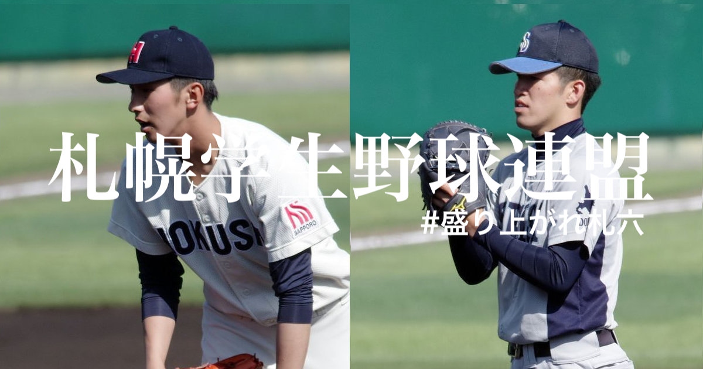

# 札幌学生野球連盟公式サイト リニューアルプロジェクト

## URL
**<a href="http://satsu6.com" target="_blank" rel="noopener">satsu6.com</a>**

## リリース日
- 2019-03-09(Sat)

## 使用技術
- Ruby 2.5.1
- Rails 5.2.1
- MySQL 8.0.12
- Bootstrap4

## 本番環境構成
- ConoHa VPS
- CentOS
- Nginx
- Unicorn

## デプロイ
- Capistrano

## 主な機能
- CRUD
    - 新着情報
    - 試合情報
    - 大会日程情報
    - 表彰選手情報
    - 明治神宮代表決定戦
- 順位表自動生成
- 情報絞り込み
- ページネーション
- 管理者ログイン
- エラーページ
- レスポンシブデザイン
    - スクリーンショット用表示切り替え機能
- SNS連携
    - ツイートボタン
    - OGP

## 今後の実装予定
- トーナメントページ
- バリデーション強化
- テスト強化
- リファクタリングの継続
